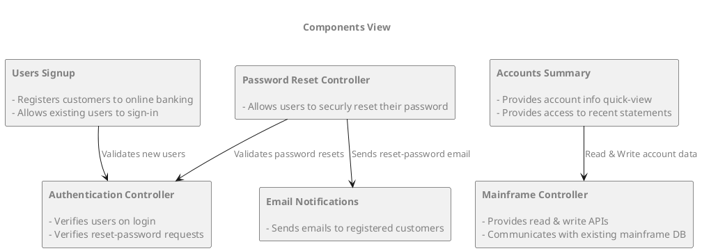

## Components

Internaly, our banking system will have components such as customer registration, authentication, email notifications etc.

```plantuml
    @startuml
    skinparam Monochrome true
    skinparam defaultFontColor Grey
    skinparam defaultFontName Noteworthy

    Title \nComponents View\n

    rectangle Signup [
        **Users Signup**

        - Registers customers to online banking
        - Allows existing users to sign-in
    ]

    rectangle Password [
        **Password Reset Controller**

        - Allows users to securly reset their password
    ]

    rectangle Auth [
        **Authentication Controller**

        - Verifies users on login
        - Verifies reset-password requests
    ]

    rectangle Email [
        **Email Notifications**

        - Sends emails to registered customers
    ]

    rectangle Account [
        **Accounts Summary**

        - Provides account info quick-view
        - Provides access to recent statements
    ]

    rectangle Mainframe [
        **Mainframe Controller**

        - Provides read & write APIs
        - Communicates with existing mainframe DB
    ]


    Signup   -down-> Auth      :Validates new users
    Password -down-> Auth      :Validates password resets
    Password -down-> Email     :Sends reset-password email
    Account  -down-> Mainframe :Read & Write account data

    @enduml
```