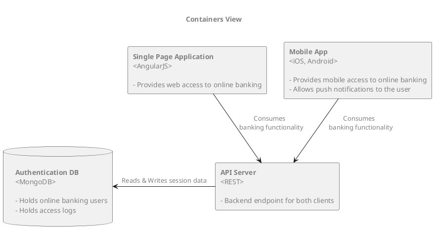

## Containers View

Our online banking system will have the following containers:
- A web SPA client
- A mobile app client
- An API server
- A database for handling authentication

```plantuml
    @startuml    
    skinparam Monochrome true
    skinparam defaultFontColor Grey
    skinparam defaultFontName Noteworthy
    
    Title \nContainers View\n

    rectangle SPA [
        **Single Page Application**
        <AngularJS>

        - Provides web access to online banking
    ]

    rectangle App [
        **Mobile App**
        <iOS, Android>

        - Provides mobile access to online banking
        - Allows push notifications to the user
    ]

    rectangle API [
        **API Server**
        <REST>

        - Backend endpoint for both clients
    ]

    database DB [

        **Authentication DB**
        <MongoDB>

        - Holds online banking users
        - Holds access logs

    ]


    SPA -down-> API :Consumes \n banking functionality
    App -down-> API :Consumes \n banking functionality
    API -left-> DB  :Reads & Writes session data

    @enduml
```