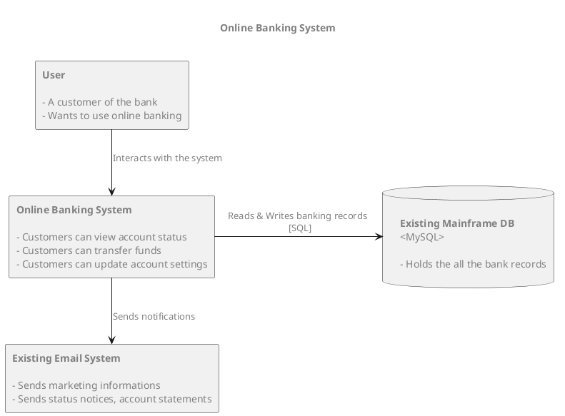

## Context View

Our online banking system should allow our users to:
- View their account information online
- Perform banking actions such as trasnferring funds and trading
- Receive email notifications for different key information

