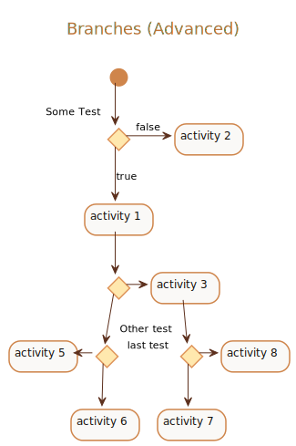

##### Branches (Advanced) Example

<details>
<summary>Click to see full PlantUML Code</summary>
<p>

```plantuml
@startuml
!include https://raw.githubusercontent.com/uri-chandler/makeitpdf/master/skins/light-orange/light-orange.skin.iuml

Title \n <u>Branches (Advanced)</u> \n

(*) --> if "Some Test" then

  -->[true] "activity 1"
  
  if "" then
	-> "activity 3" as a3
  else
	if "Other test" then
	  -left-> "activity 5"
	else
	  --> "activity 6"
	endif
  endif
  
else

  ->[false] "activity 2"
  
endif

a3 --> if "last test" then
  --> "activity 7"
else
  -> "activity 8"
endif

@enduml
```

</p>
</details>


<br />


