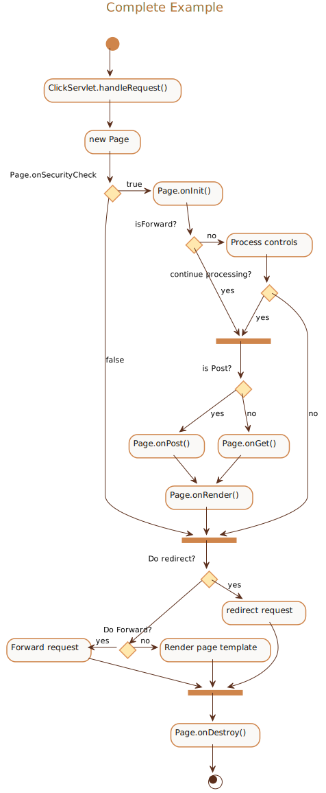

##### Complete Example

<details>
<summary>Click to see full PlantUML Code</summary>
<p>

```plantuml
@startuml
!include https://raw.githubusercontent.com/uri-chandler/makeitpdf/master/skins/light-orange/light-orange.skin.iuml

Title \n <u>Complete Example</u> \n

(*) --> "ClickServlet.handleRequest()"
--> "new Page"

if "Page.onSecurityCheck" then
  ->[true] "Page.onInit()"
  
  if "isForward?" then
   ->[no] "Process controls"
   
   if "continue processing?" then
	 -->[yes] ===RENDERING===
   else
	 -->[no] ===REDIRECT_CHECK===
   endif
   
  else
   -->[yes] ===RENDERING===
  endif
  
  if "is Post?" then
	-->[yes] "Page.onPost()"
	--> "Page.onRender()" as render
	--> ===REDIRECT_CHECK===
  else
	-->[no] "Page.onGet()"
	--> render
  endif
  
else
  -->[false] ===REDIRECT_CHECK===
endif

if "Do redirect?" then
 ->[yes] "redirect request"
 --> ==BEFORE_DESTROY===
else
 if "Do Forward?" then
  -left->[yes] "Forward request"
  --> ==BEFORE_DESTROY===
 else
  -right->[no] "Render page template"
  --> ==BEFORE_DESTROY===
 endif
endif

--> "Page.onDestroy()"
-->(*)
@enduml
```

</p>
</details>


<br />

