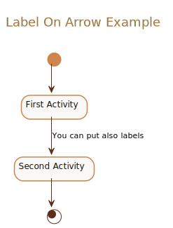

##### Label On Arrow Example

<details>
<summary>Click to see full PlantUML Code</summary>
<p>

    ```plantuml
        @startuml
        !include https://raw.githubusercontent.com/uri-chandler/makeitpdf/master/skins/light-orange/light-orange.skin.iuml

        Title \n <u>Label On Arrow Example</u> \n

        (*) --> "First Activity"
        -->[You can put also labels] "Second Activity"
        --> (*)

        @enduml
    ```

</p>
</details>


<br />

