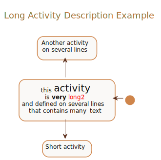

##### Label On Arrow Example

<details>
<summary>Click to see full PlantUML Code</summary>
<p>

```plantuml
@startuml
!include https://raw.githubusercontent.com/uri-chandler/makeitpdf/master/skins/light-orange/light-orange.skin.iuml

Title \n <u>Long Activity Description Example</u> \n

(*) -left-> "this <size:20>activity</size>
	is <b>very</b> <color:red>long2</color>
	and defined on several lines
	that contains many <i>text</i>" as A1

-up-> "Another activity\n on several lines"

A1 --> "Short activity"

@enduml
```

</p>
</details>


<br />

