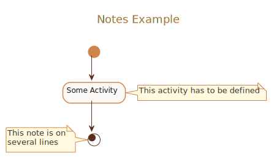

##### Notes Example

<details>
<summary>Click to see full PlantUML Code</summary>
<p>

```plantuml
@startuml
!include https://raw.githubusercontent.com/uri-chandler/makeitpdf/master/skins/light-orange/light-orange.skin.iuml

Title \n <u>Notes Example</u> \n

(*) --> "Some Activity"
note right: This activity has to be defined
"Some Activity" --> (*)
note left
 This note is on
 several lines
end note

@enduml
```

</p>
</details>


<br />

