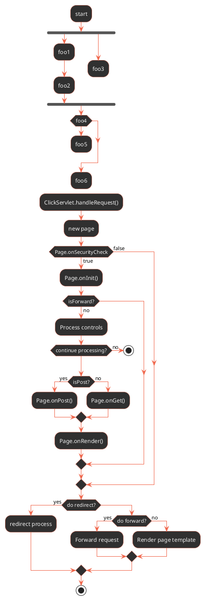

## Activity Diagram Example

Foo

```plantuml
    @startuml
    !define BACKGROUND_COLOR #303030
    !define FONT_COLOR       #F0F0F0
    !define BORDER_COLOR     #F06449
    !define ARROW_COLOR      #F06449

    skinparam Activity {
        ArrowColor             ARROW_COLOR
        FontColor              FONT_COLOR
        DiamondFontColor       FONT_COLOR
        BackgroundColor        BACKGROUND_COLOR
        DiamondBackgroundColor BACKGROUND_COLOR
        BorderColor            BORDER_COLOR
        DiamondBorderColor     BORDER_COLOR
        'FontName Size Style
        'BarColor Red
        'BorderThickness
        'DiamondFontName | Size | Style
        'EndColor
        'StartColor
    }

    :start;
    fork
        :foo1;
        :foo2;
    fork again
        :foo3;
        detach
    endfork
    
    if (foo4) then
        :foo5;
        detach
    endif
    
    :foo6;
    detach
    
    :ClickServlet.handleRequest();
    :new page;
    if (Page.onSecurityCheck) then (true)
    :Page.onInit();
    if (isForward?) then (no)
        :Process controls;
        if (continue processing?) then (no)
        stop
        endif
        
        if (isPost?) then (yes)
        :Page.onPost();
        else (no)
        :Page.onGet();
        endif
        :Page.onRender();
    endif
    else (false)
    endif

    if (do redirect?) then (yes)
    :redirect process;
    else
    if (do forward?) then (yes)
        :Forward request;
    else (no)
        :Render page template;
    endif
    endif
    stop

    @enduml
```