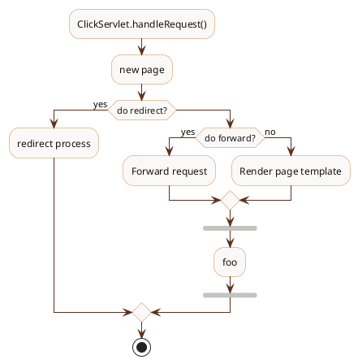

## Activity Diagram Example

```plantuml
    @startuml
    !define BACKGROUND_COLOR   #faf9f7
    !define BORDER_COLOR       #cf854b
    !define FONT_COLOR         #14110c

    !define ARROW_COLOR        #5c2f1c
    !define BAR_COLOR          #c0c5c1

    skinparam Activity {
        BackgroundColor        BACKGROUND_COLOR
        BorderColor            BORDER_COLOR
        FontColor              FONT_COLOR

        DiamondBackgroundColor BACKGROUND_COLOR
        DiamondBorderColor     BORDER_COLOR
        DiamondFontColor       FONT_COLOR

        ArrowColor             ARROW_COLOR
        BarColor               BAR_COLOR
        'FontName Size Style
        'BorderThickness
        'DiamondFontName | Size | Style
        'EndColor
        'StartColor
    }
    
    :ClickServlet.handleRequest();
    :new page;


    if (do redirect?) then (yes)
    :redirect process;
    else
    if (do forward?) then (yes)
        :Forward request;
    else (no)
        :Render page template;
    endif
    fork
    :foo;
    endfork
    endif

    stop

    @enduml
```